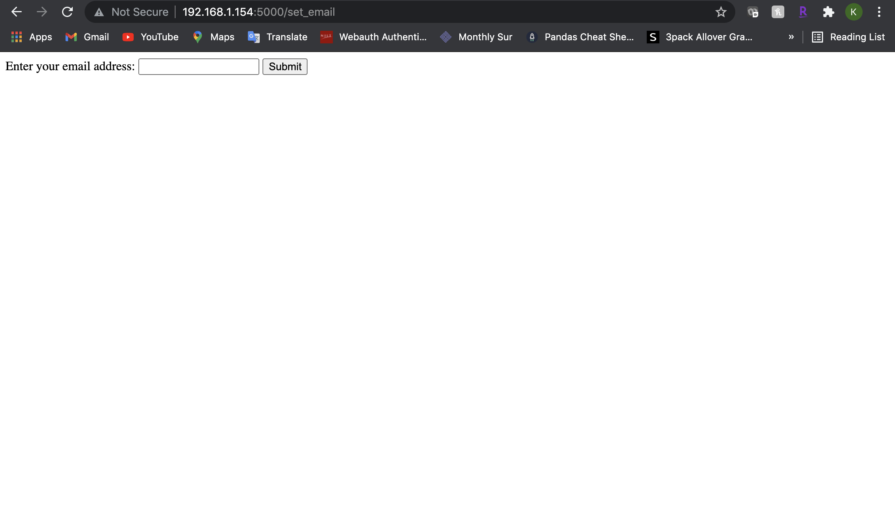
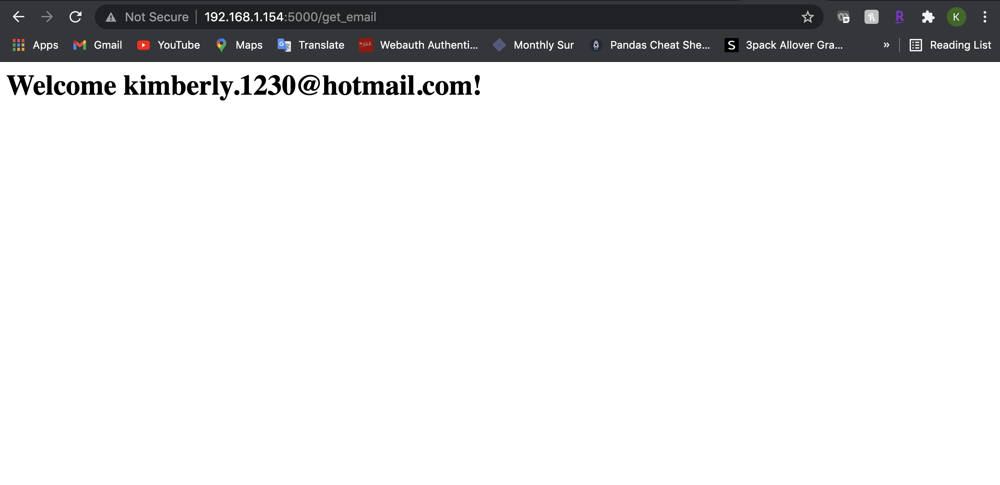
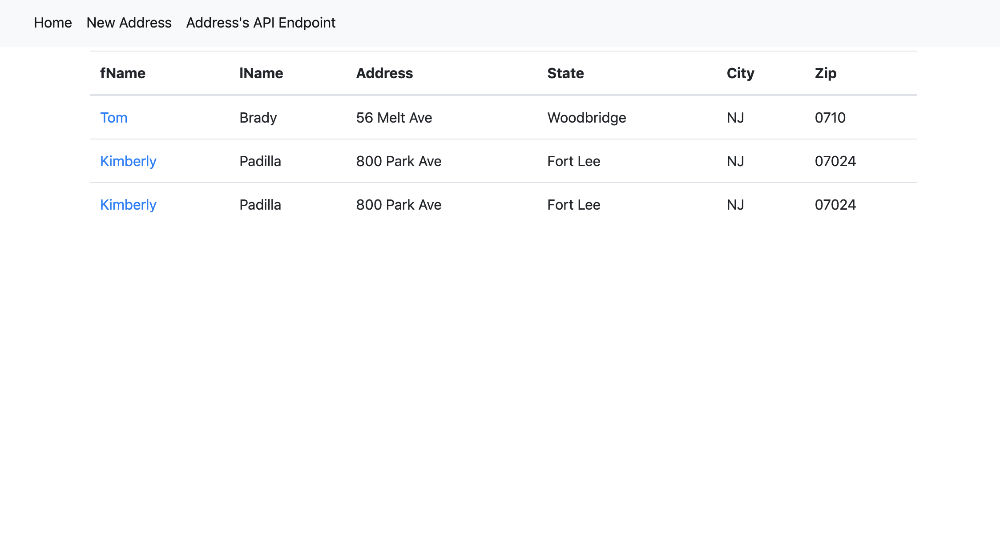
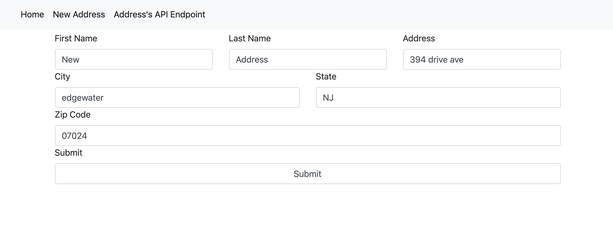
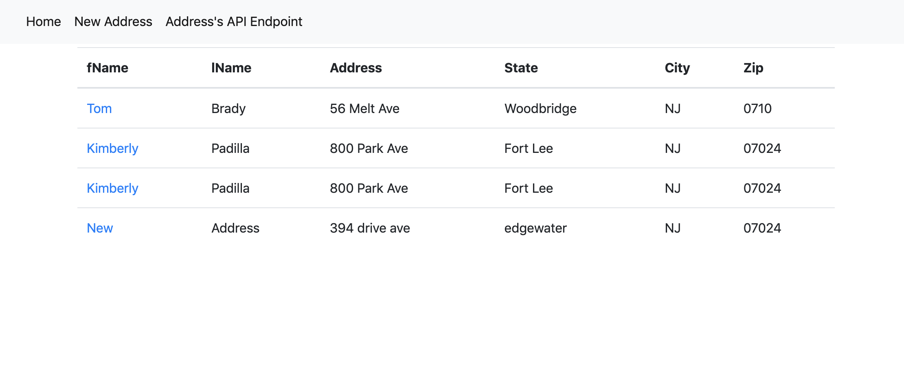
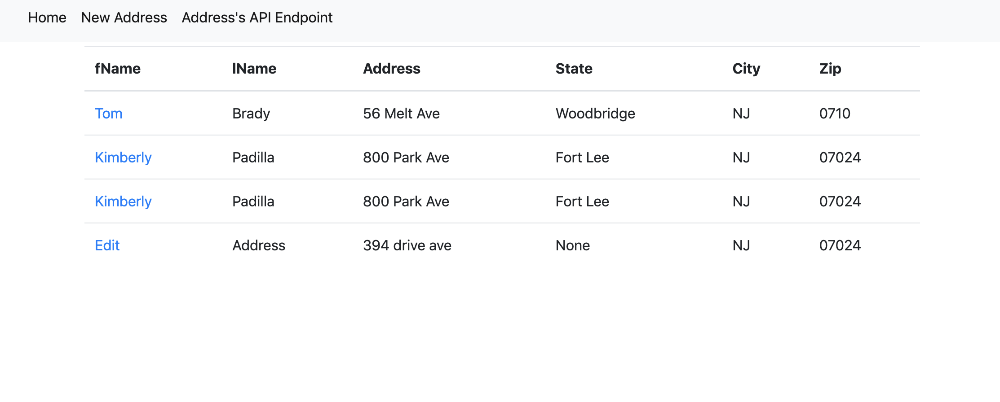
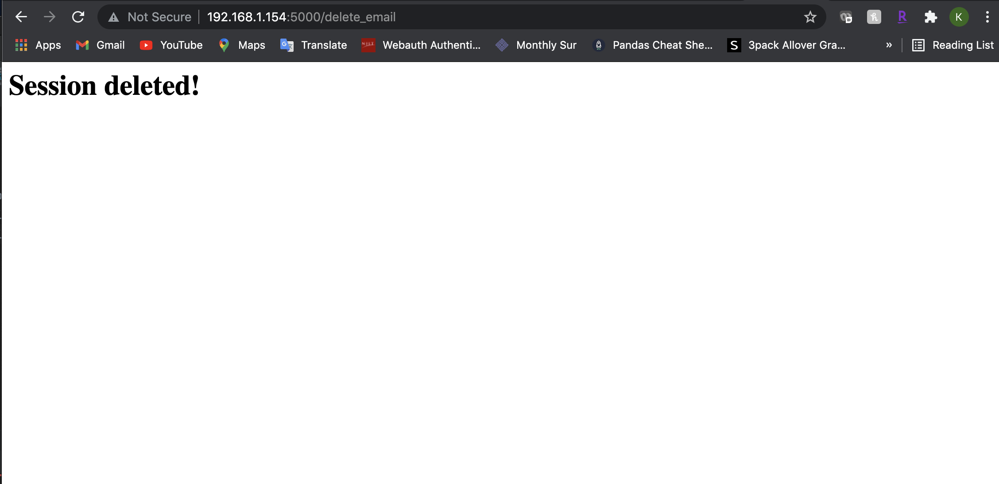

# Project 4
Kimberly Padilla

## Description:
This project ultimately teaches us how to connect flask to a database
with Flask SQLAlchemy with the capabilities of providing your own
email (user account) and creating a session when viewing the records.

## Screenshots
### Log in using an email:
</img>

### Session Created:
</img>

### Home Page:
* Once logged in (you see the Welcome page above) Insert http://192.168.1.154:5000/ in web browser
to see all records.
  
</img>
  
### New Address:
* Process of Adding New Address
    * After you click submit in the addition page, return to Home page to see the changes.

</img>

* After Adding New Address

</img>

### Editing Address:
* Editing the New Address: "New" to "Edit"
    * After you click submit in the edit page, return to Home page to see the changes.

</img>

### Session Deleted:
</img>

